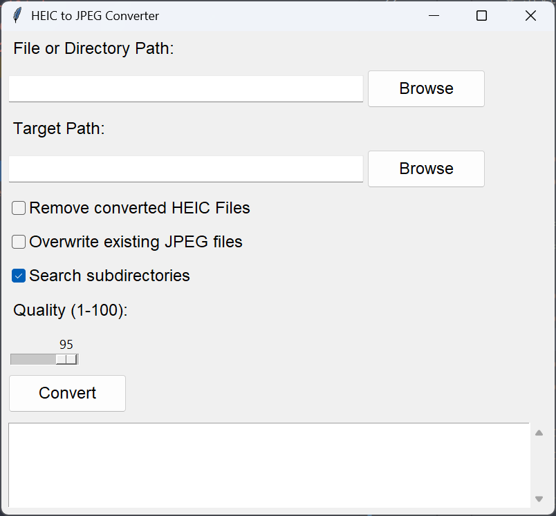
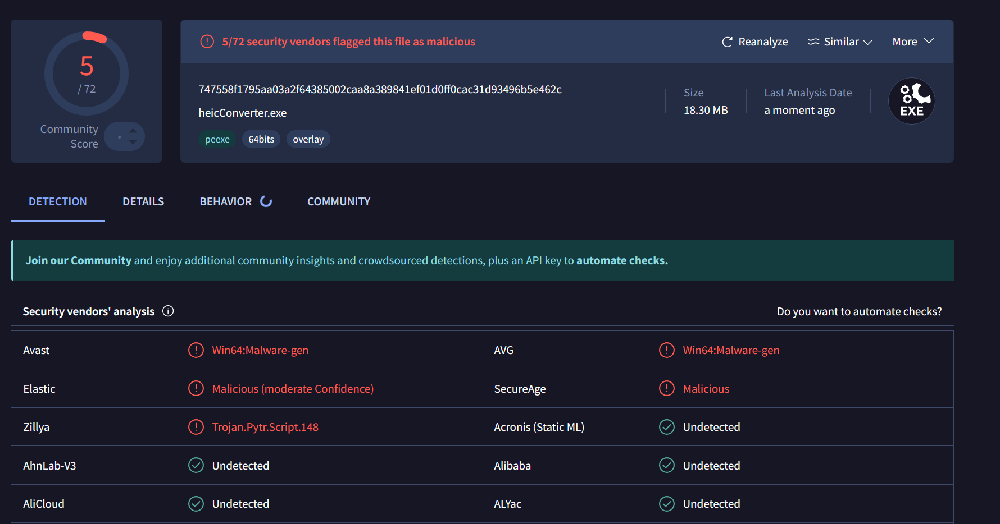
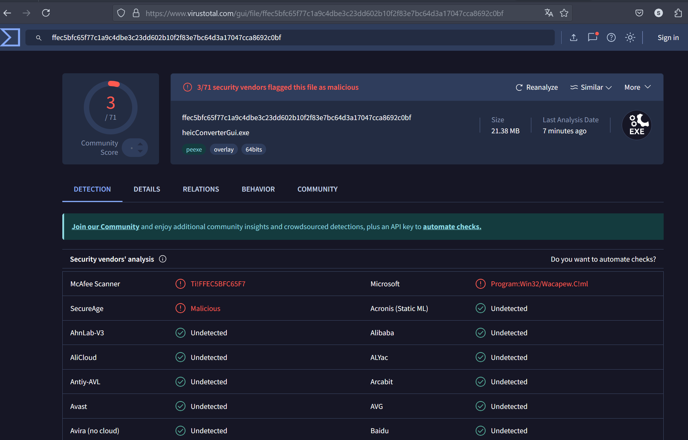
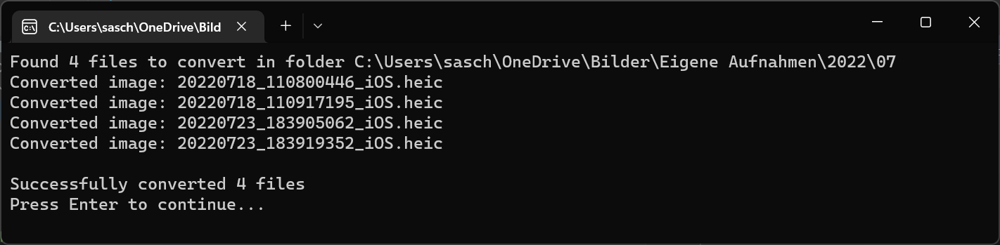

# HeicConverter

## Introduction

**Note:** This is my fork of @saschiwy's [HeicConverter](https://github.com/saschiwy/HeicConverter). I added [a PR to fix a bug in the Gui](https://github.com/saschiwy/HeicConverter/pull/23), but [the rest of the changes seemed too big](https://github.com/saschiwy/HeicConverter/compare/v0.3.0...oaustegard:HeicConverter:main) to [impose](https://github.com/saschiwy/HeicConverter/issues/24). These were all vibe-coded with Claude 3.7 Sonnet, then tested locally. IWOMM, YMMV.  The rest of this readme is (mostly) that of the original.

A very simple command line tool to convert *.heic files to jpg. Since the available programs for windows are either paid
or not working for me, I decided to make a simple python script to help convert these files.

## Features

- Convert all HEIC files to jpg in a folder and sub-folders recursively
- Skips already existing conversions
- Keep Metadata of the original file
- Optional: Remove source files
- Optional: Overwrite existing files

## Quick Usage

1. Copy the prepared exe to the folder with heic files for convert and double click it.
2. Use Command line and append the path of interest:

~~~~
./heicConverter.exe path/to/pictures
~~~~

## Command Line

Start the script (or exe) from command line for additional options:

~~~~
heicConverter.exe [-h] [-r] [-o] [--not-recursive] [--skip-prompt] [-q QUALITY] [-t TARGET] [path]

Convert HEIC files to JPEG

positional arguments:
  path                  the path to the file or directory to convert

options:
  -h, --help            show this help message and exit
  -r, --remove          Remove converted HEIC Files
  -o, --overwrite       Overwrite existing JPEG files
  --not-recursive       Do not search subdirectories
  --skip-prompt         Skip the prompt at the end
  -q QUALITY, --quality QUALITY
                        Quality of the JPG Files, default: 95
  -t TARGET, --target TARGET
                        The target directory for the converted files if not given, the source directory is used
~~~~

## GUI

Also a GUI Version is available. Just run `pythonw .\heicConverterGui.py` from the download directory

## Alternative Installation of @saschiw's version:

### Windows

Download the latest release from the [Release Page](https://github.com/saschiwy/HeicConverter/releases) and extract it
somewhere on your machine.

### Linux / Mac

Download the repo, install the dependencies and run the script.

## Development Dependencies

Install the python package dependencies with:

~~~~
pip install -r requirements.txt
~~~~

## Create your own executable

Install pyinstaller with:

~~~~
pip install pyinstaller
~~~~

Install the dependencies, navigate with a console to the source dir and run the following commands:

~~~~
python -m PyInstaller --onefile --console heicConverter.py
python -m PyInstaller --onefile --windowed heicConverterGui.py
~~~~

## Remarks

The basic software was mainly created by people at StackOverflow:
https://stackoverflow.com/questions/54395735/how-to-work-with-heic-image-file-types-in-python

... and see my (@oaustegard's) notes about the fork

## Virus Detection

Some people reported that their virus scanner detected a virus in the exe file. According to this reddit post:
[Windows Defender found "wacapew.c! ml"](https://www.reddit.com/r/computerviruses/comments/mkrmg7/windows_defender_found_wacapewc_ml/)
the pyinstaller
is adding a file which can be detected as virus. I can assure you, I did not add any virus. However, I used external
libraries and I cannot guarantee that they are free of viruses. If you are unsure, you can either create a exe yourself
(see above) or use the python script directly.

Also, very interesting is, that the console tool has a higher detection rate than the GUI tool. According to another
reddit post, the python exe creation uses some similar signature as a
virus. [My python program is a Trojan?](https://www.reddit.com/r/learnpython/comments/18s8y0x/my_python_program_is_a_trojan/)

[VirusTotal Console](https://www.virustotal.com/gui/file/747558f1795aa03a2f64385002caa8a389841ef01d0ff0cac31d93496b5e462c)

[VirusTotal GUI](https://www.virustotal.com/gui/file/ffec5bfc65f77c1a9c4dbe3c23dd602b10f2f83e7bc64d3a17047cca8692c0bf)

The number of detections is still very low with 3/72 and 5/72.

**If you still have concerns I recommend to not use this software.**

## Example

## Contribution

Thanks to all contributors. Feel free to fork and improve the code.
